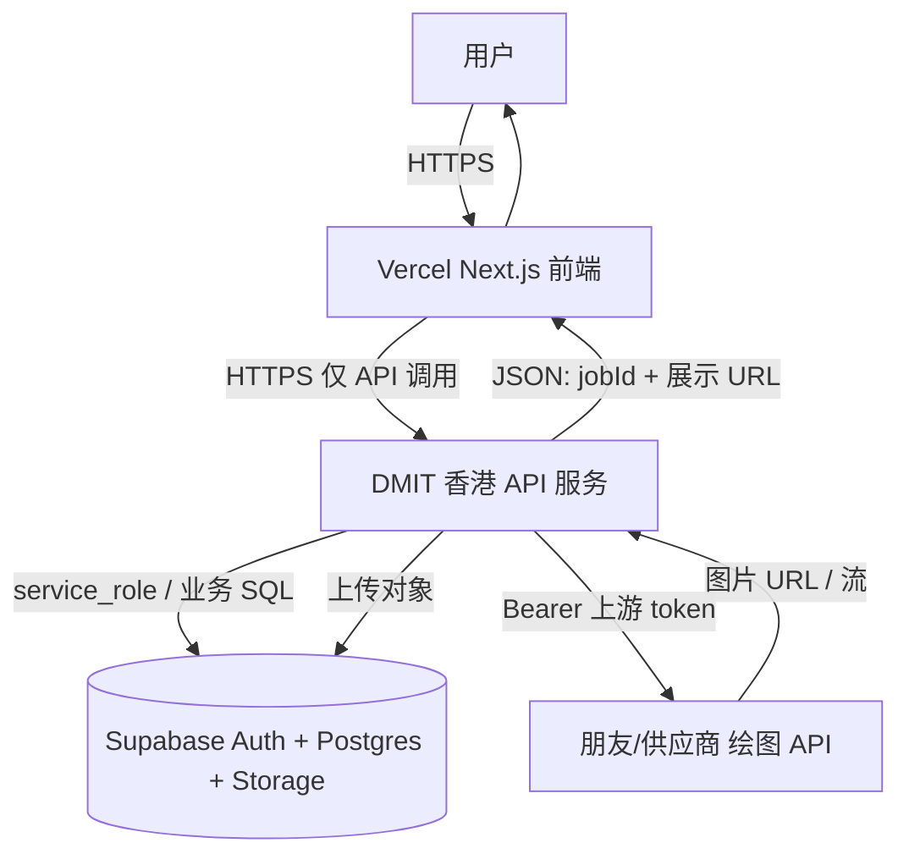

# 架构计划：Vercel 前端 · DMIT 香港 API · Supabase 账本与存储

> 目标一句话：**Vercel = 用户界面**；**DMIT = 后端中转与任务执行**；**Supabase = 用户、账本、任务、图片存储**；**模型 token = 图片生成供给**。

---

## 总架构图（逻辑）

数据流（与当前单体相比，**生成主链从 Vercel 迁到 DMIT**）：

| 步骤 | 执行方 | 说明 |
|------|--------|------|
| 登录 / 会话 | Vercel（现有） | 仍用 Supabase Auth + Cookie；前端只拿 **JWT** 或经 Vercel **Route Handler 换票** 再调 DMIT。 |
| 校验用户身份 | **DMIT** | 校验 `Authorization: Bearer <supabase_access_token>`（JWKS 验签）或 **Vercel→DMIT 服务密钥 + user_id**（二选一，见下文）。 |
| 查询 credits | **DMIT** | 读 Supabase：`profiles.balance_images` 或未来 **`credits_ledger` 汇总**。 |
| 创建任务 | **DMIT** | 插入 **`image_jobs`**（当前表名；你图中的 `generation_job` 可视为同概念）`pending`。 |
| 调模型 | **DMIT** | 现有逻辑等价于 `lib/upstream/image-generation.ts`（仅服务端环境变量）。 |
| 收图 / 上传 Storage | **DMIT** | 等价于 `persistJobImageToStorage`；路径仍建议 `{userId}/{jobId}.…`。 |
| 写库 | **DMIT** | 更新 `image_jobs`；扣费写 **`profiles.balance_images`** 或迁移为 **`credits_ledger` 流水 + 余额视图**。 |
| 返回 URL | **DMIT** | JSON：`imageUrl`、`jobId`、`balanceImages` 等，与现 `GenerateImageResult` 对齐即可。 |

---

## 与当前仓库的映射

| 你计划中的名字 | 当前仓库 | 备注 |
|----------------|----------|------|
| `generation_job` | `image_jobs` | 可直接沿用表名，减少迁移。 |
| `images` 表 | 无独立表 | 当前用 **`image_jobs.image_url` + `storage_path`**；若要独立 `images`，属二期表结构拆分。 |
| `credits_ledger` | 无 | 当前为 **`profiles.balance_images`** 整数 + 触发器防前端改余额；若要流水账，**新增迁移** `credits_ledger`，扣费在 DMIT 内 **事务：ledger + 更新余额**。 |

核心业务代码 today 集中在 **`lib/run-generate-image.ts`** 及 **`lib/upstream/`**、**`lib/storage/`**；拆架构时优先 **整段迁到 DMIT 服务**（或抽成 **`packages/generation-core`** 供双端编译），避免两套逻辑漂移。

---

## 身份与信任边界（必须定案）

**方案 A（推荐）**：浏览器 / Vercel **把 Supabase `access_token`** 传给 DMIT，`GET/POST https://api.yourdomain.com/v1/...`，DMIT 用 **JWT 验签**（Supabase JWKS）解析 `sub` = `user_id`，再 `service_role` 访问数据库。  
- 优点：DMIT 不依赖 Vercel 伪造用户。  
- 注意：**CORS** 仅允许你的 Vercel 域名；**HTTPS**；Token 过期需前端刷新会话。

**方案 B**：仅 **Vercel 服务端**（Server Action / Route Handler）调 DMIT，带 **`X-Internal-Secret` + user_id`**，DMIT 信任该密钥。  
- 优点：模型 token、service_role 从不暴露给浏览器。  
- 缺点：所有生成流量经 Vercel 出站（与你「DMIT 直连上游」的动机略冲突）；需 **IP  allowlist 或 HMAC** 防伪造。

**混合**：敏感操作用 B；大文件参考图若需直传可再设计预签名 URL（二期）。

---

## 分阶段实施计划

### 阶段 0：准备

- [ ] DMIT：域名 + TLS（Caddy/Nginx）、防火墙 **443**、**Node 20+** 或 Docker。
- [ ] Supabase：**Site URL / Redirect URLs** 仍指向 **Vercel 前端域名**（登录不变）。
- [ ] 新增环境变量：`BACKEND_API_URL`（Vercel）、`SUPABASE_JWT_SECRET` 或 JWKS URL（DMIT 验签用，以 Supabase 文档为准）、上游 `UPSTREAM_*` 仅配在 **DMIT**。

### 阶段 1：DMIT 最小 API

- [ ] 实现 `GET /health`。
- [ ] 实现 `POST /v1/generate` 骨架：验身份 → 读余额 → 返回 402 占位（不接上游）。
- [ ] 日志与超时（生图仍建议 **120s+** 可配置）。

### 阶段 2：迁移生成主链

- [ ] 将 **`runGenerateImageJob` 等价逻辑** 迁入 DMIT（复制后删 Vercel 侧重复，或抽共享包）。
- [ ] 上游只从 DMIT 出口访问（香港线路对你供应商更友好时可体现价值）。
- [ ] 与现表 **`image_jobs` / `profiles`** 读写一致，保证 Vercel 上 **Dashboard** 仍可读同一库（仅读 Supabase，或 Dashboard 也改调 API，二期）。

### 阶段 3：Vercel 前端改调用

- [ ] `app/generate/actions.ts`（或 Route Handler）改为 **`fetch(BACKEND_API_URL, { headers: { Authorization: `Bearer ${token}` } })`**，body 与现 JSON 对齐。
- [ ] 删除或降级 Vercel 上的 **`UPSTREAM_API_KEY`**（避免泄露到边缘函数日志）。
- [ ] `/api/image/generate`：要么 **代理到 DMIT**，要么废弃，统一走 DMIT。

### 阶段 4：账本增强（可选）

- [ ] 新增 **`credits_ledger`**：每次扣费插入一行，`profiles.balance_images` 由触发器或应用层同步。
- [ ] Dashboard 展示流水（二期 UI）。

### 阶段 5：观测与风控

- [ ] DMIT：按 `user_id` / IP **限流**；失败重试策略；**告警**（磁盘、内存、上游错误率）。

---

## 一句话回顾

**Vercel** 只保留 UI、Auth 会话与对 **DMIT API** 的调用；**DMIT** 持有上游 token 与 **service_role**，负责 **校验、扣费、任务、存图**；**Supabase** 仍是唯一真相源；演进时表名可从 **`image_jobs` / `profiles.balance_images`** 平滑扩展到 **`credits_ledger`**。

若你确认采用 **方案 A 或 B**，下一步可在仓库里拆 **`apps/web`（Vercel）** + **`apps/api`（DMIT）** 或单包 `packages/generation`，再落具体接口契约（OpenAPI / Zod）。
