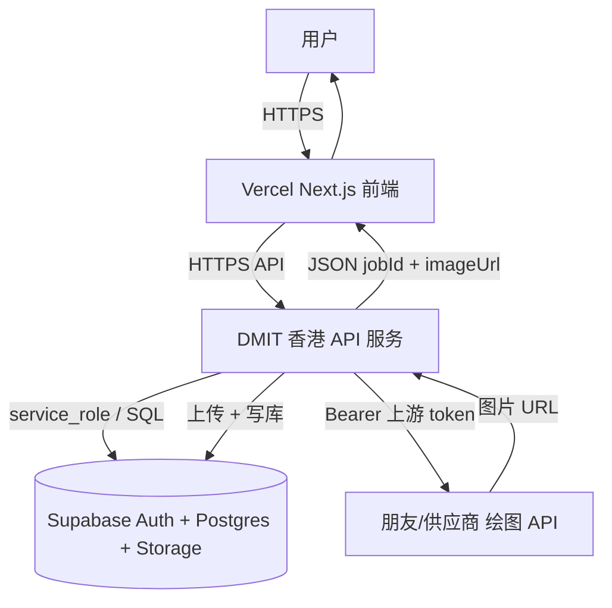

# Nano Banana Pro — 完整说明文档

本文档为仓库 **功能、数据、环境、部署、架构演进** 的合并版，便于单独分享或打印。细节实现仍以代码为准。

**相关文件**：根目录 [`README.md`](../README.md)（日常维护入口）、[`STYLE.md`](../STYLE.md)（视觉规范）、[`docs/ARCHITECTURE_PLAN_VERCEL_DMIT.md`](./ARCHITECTURE_PLAN_VERCEL_DMIT.md)（Vercel + DMIT 拆分计划节选）。

---

## 目录

1. [项目概述](#1-项目概述)
2. [技术栈与目录结构](#2-技术栈与目录结构)
3. [总架构（当前与目标）](#3-总架构当前与目标)
4. [环境变量](#4-环境变量)
5. [上游绘图逻辑摘要](#5-上游绘图逻辑摘要)
6. [HTTP 接口](#6-http-接口)
7. [图片与 Storage](#7-图片与-storage)
8. [Supabase 数据模型](#8-supabase-数据模型)
9. [认证、回调与登录问题](#9-认证回调与登录问题)
10. [业务规则与内测](#10-业务规则与内测)
11. [NPM 脚本与本地开发](#11-npm-脚本与本地开发)
12. [部署：Vercel](#12-部署vercel)
13. [部署：自有 VPS（含 DMIT）](#13-部署自有-vps含-dmit)
14. [安全与合规](#14-安全与合规)
15. [常见问题](#15-常见问题)
16. [许可证](#16-许可证)

---

## 1. 项目概述

**Nano Banana Pro** 是一套轻量 **AI 图片生成中转台**：用户登录后在 **`/generate`** 选择模型并提交提示词，服务端调用上游绘图能力，将结果写入 **Supabase**；默认每次成功扣 **`profiles.balance_images` 1 次**；次数不足需运营人工充值。不接 Stripe，不做复杂分销后台（`price_cny` 仍可按模型写入库备查）。

---

## 2. 技术栈与目录结构

### 2.1 技术栈

| 层级 | 技术 |
|------|------|
| 框架 | Next.js 16（App Router） |
| 语言 | TypeScript |
| 样式 | Tailwind CSS 4 |
| 认证与数据库 | Supabase（Auth + Postgres + RLS + Storage） |
| 部署 | Vercel（推荐）或自有 Linux（`output: "standalone"`） |
| 架构演进（计划） | [Vercel 前端 + DMIT API + Supabase](./ARCHITECTURE_PLAN_VERCEL_DMIT.md) |

### 2.2 仓库结构（要点）

```text
STYLE.md                   # 视觉规范
app/
  page.tsx                 # 首页
  layout.tsx               # 根布局 + Supabase 未配置提示
  login/, signup/          # 邮箱密码登录注册
  auth/callback/route.ts   # 邮箱验证 / PKCE 换票回调
  generate/                # 生图页 + Server Actions
  dashboard/               # 记录与余额
  api/                     # prompt、image/generate、image/signed
components/
lib/
  run-generate-image.ts    # 生成主流程
  upstream/image-generation.ts
  storage/                 # 桶、上传、签名、参考图校验
  models.ts                # 模型白名单与画质档位
  supabase/                # client / server / admin / middleware
middleware.ts
supabase/migrations/       # SQL 迁移
.cursor/hooks.json        # 可选：Agent stop 后自动 git push
```

---

## 3. 总架构（当前与目标）

### 3.1 当前（单体 Next.js）

用户浏览器 → **Vercel（或 VPS）上的 Next.js** → 同进程内：Supabase Auth、**service_role** 写库、调上游、写 Storage → 返回页面 / JSON。

### 3.2 目标（计划）：Vercel 前端 + DMIT 香港 API

> **Vercel = 用户界面**；**DMIT = 后端中转与任务执行**；**Supabase = 用户、账本、任务、图片存储**；**模型 token = 图片生成供给**。



| 步骤 | 计划执行方 | 与现仓库对应 |
|------|------------|----------------|
| 登录 / 会话 | Vercel | 现有 Supabase Auth + Cookie |
| 校验用户、扣次、建任务、调模型、存图 | DMIT | 现 `lib/run-generate-image.ts` 等迁入 |
| 数据真相源 | Supabase | `profiles`、`image_jobs`、Storage |

**表名映射（计划用语 ↔ 仓库）**：`generation_job` ↔ **`image_jobs`**；独立 `images` 表 ↔ 当前 **`image_jobs` + `storage_path`**；`credits_ledger` ↔ 当前 **`profiles.balance_images`**（流水账为可选二期）。

**身份方案摘要**：**A** 浏览器/DMIT 验 Supabase JWT；**B** 仅 Vercel 服务端带内部密钥调 DMIT。详见 [ARCHITECTURE_PLAN_VERCEL_DMIT.md](./ARCHITECTURE_PLAN_VERCEL_DMIT.md)。

---

## 4. 环境变量

复制 [`.env.example`](../.env.example) 为 `.env.local`（本地）或在 **Vercel / VPS** 中配置。

### 4.1 Supabase（必配）

| 变量 | 可见性 | 说明 |
|------|--------|------|
| `NEXT_PUBLIC_SUPABASE_URL` | 浏览器 | 项目 HTTPS URL |
| `NEXT_PUBLIC_SUPABASE_ANON_KEY` | 浏览器 | `anon` 公钥 |
| `SUPABASE_SERVICE_ROLE_KEY` | **仅服务端** | `service_role`；**禁止** `NEXT_PUBLIC_` |
| `SUPABASE_GENERATION_BUCKET` | 服务端可选 | 默认 `generations` |
| `GENERATION_TESTING_MODE` | 服务端可选 | `1` / `true` / `yes`：不扣次，仍写库与 Storage |
| `ANONYMOUS_GENERATE_AS_USER_ID` | 服务端可选 | 与上项同时启用时免登录生成（须为已有 `profiles` 的用户 UUID）；**测完必关** |

### 4.2 上游绘图（服务端必配）

| 变量 | 说明 |
|------|------|
| `UPSTREAM_API_KEY` | Bearer Token |

模型 id 在 **`lib/models.ts`** 的 `IMAGE_MODELS` 中维护。

**推荐**：完整 URL

| 变量 | 说明 |
|------|------|
| `UPSTREAM_DRAW_URL` | 创建任务 POST 完整 URL |
| `UPSTREAM_RESULT_URL` | 轮询结果 POST 完整 URL |

**或**：`UPSTREAM_BASE_URL` + `UPSTREAM_DRAW_PATH` + `UPSTREAM_RESULT_PATH`

**可选**：`UPSTREAM_REFERENCE_URLS`、`UPSTREAM_ASPECT_RATIO`、`UPSTREAM_BANANA_IMAGE_SIZE`、`UPSTREAM_POLL_INTERVAL_MS` 等（见 `.env.example`）。

### 4.3 直连 Postgres（可选）

业务代码不依赖 `DATABASE_URL`；仅用于 Prisma / 分析工具。端口：API **443**、Session **5432**、Pooler **6543**。

---

## 5. 上游绘图逻辑摘要

1. `POST` **DRAW** URL：JSON 含 `model`、`prompt`、`aspectRatio`、`imageSize`、`urls`、等（见 `lib/upstream/image-generation.ts`）。
2. 解析任务 `id`。
3. 循环 `POST` **RESULT** URL 轮询至成功/失败或超时（约 120s）。

---

## 6. HTTP 接口

| 方法 | 路径 | 说明 |
|------|------|------|
| `POST` | `/api/prompt` | 提示词校验；Body `{ "prompt" }` |
| `POST` | `/api/image/generate` | 与 Server Action 同逻辑；Body 含 `prompt`、`modelId`、`testNote?`、`aspectRatio?`、`imageSize?`、`referenceImageUrls?`（可选；有参考图时提示词至少 5 字） |
| `GET` | `/api/image/signed?jobId=` | 为本人任务重签 48h 图片 URL |

页面 `/generate` 默认走 **Server Action**。

---

## 7. 图片与 Storage

1. 成功后从上游临时 URL **下载**并上传至 **Supabase Storage** 私有桶（默认 `generations`）。  
2. `image_jobs.storage_path`、`image_url`（约 **48h** 签名）。  
3. 上传失败可回落上游直链。  
4. Dashboard 对有 `storage_path` 的记录可重新签发。  
5. 控制台需建桶并执行迁移 `20260428100000_job_image_storage.sql`。

---

## 8. Supabase 数据模型

### 8.1 `profiles`（与 `auth.users` 1:1）

| 字段 | 说明 |
|------|------|
| `id` | 用户 UUID |
| `email`、`display_name` | 展示 |
| `balance_images` | 剩余张数（客户端不可私自改，见触发器） |

### 8.2 `image_jobs`

| 字段 | 说明 |
|------|------|
| `id`、`user_id`、`prompt` | 主键与用户、提示词 |
| `model`、`model_label` | 上游 id 与展示名 |
| `status` | `pending` / `succeeded` / `failed` |
| `image_url`、`storage_path` | 结果访问与对象路径 |
| `price_cny`、`test_note`、`aspect_ratio`、`image_size` | 计价与选项 |
| `is_showcase` | 首页图廊精选 |
| 等 | 见迁移与 `README` |

### 8.3 `recharge_records`

人工充值流水；示例 SQL 见根目录 `README.md`「人工充值示例」。

### 8.4 迁移列表（建议顺序）

- `20260426140000_init.sql`
- `20260427120000_image_jobs_model_label.sql`
- `20260428100000_job_image_storage.sql`
- `20260428120000_image_jobs_showcase.sql`
- `20260428140000_image_jobs_aspect_size.sql`

---

## 9. 认证、回调与登录问题

- **`/auth/callback`**：`app/auth/callback/route.ts`，用 `code` 做 `exchangeCodeForSession`，Cookie 写在重定向响应上。  
- **Supabase → URL Configuration**：**Site URL** = 生产前端；**Redirect URLs** 必须包含 `https://你的域名/**` 与 **`https://你的域名/auth/callback`**。  
- **登录后整页跳转**：登录/注册成功使用 `window.location.assign`，避免仅 `router.push` 时服务端读不到新 Cookie。  
- **开发**：可关闭「Confirm email」便于联调。

---

## 10. 业务规则与内测

- 默认仅登录用户可生成；**内测 + `ANONYMOUS_GENERATE_AS_USER_ID`** 时允许免登录（公网慎用）。  
- 非内测且 `balance_images < 1` 拒绝生成。  
- 先插 `image_jobs` `pending`，再调上游；成功写图与 `succeeded`；失败 `failed` **不扣次**；非内测成功 **扣 1**。  
- 模型与 `price_cny` 仅信任服务端 `getImageModel(modelId)`。  
- **生成页**：提示词 + 可选参考图同一界面；有参考图时提示词至少 5 字，否则至少 1 字；参考图 URL 经服务端白名单校验。

---

## 11. NPM 脚本与本地开发

| 命令 | 说明 |
|------|------|
| `npm run dev` | 本地开发 |
| `npm run build` / `npm run start` | 生产构建与启动 |
| `npm run lint` | ESLint |
| `npm run db:*` | Supabase CLI（见 README） |

```bash
cp .env.example .env.local
# 填写 Supabase、上游；内测可加 GENERATION_TESTING_MODE=1
npm install && npm run dev
```

**Cursor 钩子（可选）**：`.cursor/hooks.json` 在 Agent `stop` 且 `completed` 时执行 `auto-git-sync.sh`（自动 commit + push）；不需要时在 Cursor Settings → Hooks 关闭。

---

## 12. 部署：Vercel

1. 连接仓库，Framework **Next.js**。  
2. **Environment Variables** 全量配置，且勾选 **Production**，保存后 **Redeploy**。  
3. Supabase **Site URL / Redirect URLs** 含 **`/auth/callback`**。  
4. 执行远程迁移。

**访问异常**：Deployment Protection、环境变量未进 Production、国内对 `*.vercel.app` 不稳定 → 绑自定义域名等（详见根 `README`）。

**超时**：`/generate` 配置了 `maxDuration = 120`；套餐限制见 Vercel 文档。

---

## 13. 部署：自有 VPS（含 DMIT）

- **`next.config.ts`**：`output: "standalone"` → `.next/standalone/server.js`。  
- **1 GB 内存**：构建易 OOM → **Swap 2G** 或在 CI/本机构建后同步 **`standalone` + `.next/static` + `public`**。  
- 运行前复制：`cp -r public .next/standalone/`；`cp -r .next/static .next/standalone/.next/`。  
- `HOSTNAME=0.0.0.0 PORT=3000 node server.js` + **systemd/pm2** + **Caddy/Nginx** TLS。

**DMIT 作为计划中的 API 节点**：与「整站 Next standalone」可并存——同一机器可跑 **Node API 进程** 与/或 **Next 前端**；架构拆分后上游密钥只放在 **DMIT API** 环境。

---

## 14. 安全与合规

- 勿将 `SUPABASE_SERVICE_ROLE_KEY`、`UPSTREAM_API_KEY` 暴露为 `NEXT_PUBLIC_*`。  
- 提示词敏感词见 `lib/sensitive.ts`；商用与合规自负。  
- 拆分架构后上游密钥应撤离 Vercel，仅保留在 DMIT。

---

## 15. 常见问题

| 问题 | 处理方向 |
|------|-----------|
| 注册无 profile | 检查迁移与触发器 `on_auth_user_created` |
| 生成「服务未配置」 | `UPSTREAM_DRAW_URL` / `UPSTREAM_RESULT_URL`、`UPSTREAM_API_KEY`、`lib/models.ts` 模型 id |
| 登录无反应 / 注册不跳转 | Cookie、`/auth/callback`、Redirect URLs、`window.location.assign` |
| Vercel 他人打不开 | Protection、Production 环境变量、自定义域名、运营商 |
| Middleware 警告 | Next 16 提示，可按官方迁移到 Proxy |

**内测执行**：不重扩 README；自检 + 5 组固定任务 + 朋友填表见 [`BETA_TEST_MATRIX.md`](./BETA_TEST_MATRIX.md)。

---

## 16. 许可证

私有项目；开源请自行补充 `LICENSE`。

---

*文档生成自仓库当前状态；若与 `README.md` 有冲突，以较新提交为准。*
